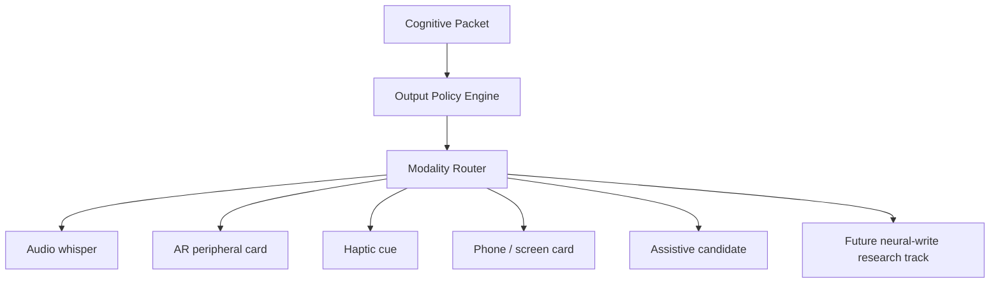

# SYMBORG


**A symbiotic cognitive front-end layer for human-AI interaction.**

SYMBORG is a product and research concept for a non-invasive cognitive interface that detects real-world context, retrieves relevant knowledge, compresses it into brief cognitive packets, and returns those packets to the user through subtle sensory channels such as audio, AR, haptics, or assistive communication outputs.

The project does **not** propose uploading knowledge into the brain. It asks a narrower and more practical question:

> If AI can retrieve more information than a person can hold in attention, what is the right interface for returning that information to human consciousness without disrupting agency, attention, or social presence?

## Core Positioning

Brain-computer interfaces focus on decoding neural intent and enabling control. Large language models focus on retrieval, reasoning, and generation. SYMBORG explores the missing layer between those domains: a **cognitive front-end** that makes returned information usable by a human mind in real time.

**Short version:** neural interfaces can decode intent; SYMBORG explores how intent, context, and retrieved knowledge can be shaped back into meaningful human communication.

## What This Repository Contains

- A concise whitepaper draft
- A system architecture for the SYMBORG interaction loop
- A product roadmap from wearable AI to BCI-compatible assistive communication
- Ethical design principles for attention, agency, and mental privacy
- A cognitive thought model and intervention map
- A signal ladder that separates realistic v0 inputs from future BCI-compatible work
- Demo scenarios for portfolio and prototype development
- A minimal heuristic contextual whisper prototype
- A feedback and device output layer with modality routing
- An integrated browser demo connecting packet generation, quality gating, and routing
- A launch kit for LinkedIn and X
- Visual assets for a professional case study, deck, or landing page

## Core Thesis

The future problem is not only storing knowledge or decoding the brain. It is routing the right knowledge into attention at the right moment, in the right amount, while preserving human agency.

SYMBORG treats intelligence augmentation as an interface design problem:

```text
Environment, conversation, user state
        |
        v
Context Engine
        |
        v
Retrieval Engine + Local Memory Vault
        |
        v
Cognitive Packet Engine
        |
        v
Confidence, Safety, and Ethics Filter
        |
        v
Audio, AR, haptic, or assistive communication output
        |
        v
Human attention, thought, and communication
```

## Brain Thought Model

SYMBORG uses a practical working model of thought formation. It is not a claim that the brain literally works like software; it is an interface abstraction.

```text
Trigger -> salience -> association -> competition -> conscious access -> expression -> feedback
```

SYMBORG does not try to replace this loop. It enters around narrow support points:

- **Before the thought fully forms:** by reading conversation context.
- **During associative retrieval:** by retrieving relevant knowledge faster than manual search.
- **At the attention gate:** by compressing information into small cues that fit working memory.
- **At verbal preparation:** by suggesting possible questions, anchors, counterpoints, or sentence candidates.

See [docs/brain-thought-model.md](docs/brain-thought-model.md) and [docs/where-symborg-intervenes.md](docs/where-symborg-intervenes.md).

## Signal Ladder

The project separates five kinds of signal. This prevents overclaiming and keeps the first prototype realistic.

```text
L0 - Environmental signal: conversation, audio, screen context, calendar, notes.
L1 - Behavioral signal: pauses, speech rhythm, gaze, head movement, ring gestures.
L2 - Physiological signal: heart rate, breathing, eye movement, muscle tension.
L3 - Non-invasive neural signal: EEG, fNIRS, P300, SSVEP, motor imagery research.
L4 - Invasive BCI signal: medical/regulatory context and future assistive workflows.
```

SYMBORG v0 should optimize **L0 + L1** first. Later versions may explore L2/L3 for load awareness. L4 belongs to future-compatible assistive communication research, not an early consumer claim.

See [docs/signal-strategy.md](docs/signal-strategy.md).

## Key Concept: Cognitive Packet Engine

The Cognitive Packet Engine is the central design contribution. It converts large bodies of information into small, timely, socially usable cues.

It does not try to replace the user's thought. It increases the probability that the right thought, question, phrase, or memory reaches conscious attention at the right time.

Example:

```text
Input context:
"The conversation has shifted to Great Expectations and class anxiety."

Bad output:
"Charles Dickens was born in 1812..."

SYMBORG output:
"Pip: shame, class desire, guilt. Ask whether ambition is really self-escape."
```

A packet is not an article. It is a thought seed.

```json
{
  "type": "question",
  "cue": "Ask whether Pip wants Estella, or the class world she represents.",
  "depth": 1,
  "confidence": 0.82,
  "delivery": "audio_whisper",
  "interrupt_risk": "low"
}
```

## Evaluation Layer

SYMBORG should not only generate cues; it should measure whether a cue is worth interrupting a human mind.

The prototype now treats every cognitive packet as a scored object with measurable properties:

```text
brevity + actionability + confidence + low interruption risk + low cognitive load
```

This allows the project to test questions such as:

- Is the cue short enough to fit working memory?
- Does it suggest a usable thought move rather than dumping facts?
- Should the system speak now, wait, or stay silent?
- Did the packet preserve user agency?
- Was the assistive candidate useful for a low-bandwidth user?

See [docs/cognitive-packet-engine-spec.md](docs/cognitive-packet-engine-spec.md), [docs/evaluation-protocol.md](docs/evaluation-protocol.md), and [docs/latency-and-interruption-model.md](docs/latency-and-interruption-model.md).

Prototype commands:

```bash
cd prototypes/contextual-whisper-demo
PYTHONPATH=src python -m symborg.heuristic_engine examples/dickens_context.txt --pause-ms 900 --delivery audio_whisper
PYTHONPATH=src python -m symborg.evaluate evaluation/fixtures.jsonl
PYTHONPATH=src python -m unittest discover tests
```

## Feedback and Device Layer

SYMBORG should be treated as a family of output interfaces, not a single device. After the Cognitive Packet Engine creates a thought seed, an Output Policy Engine decides whether the cue should be returned, and a Modality Router decides how it should be returned: audio whisper, AR card, haptic cue, screen card, assistive sentence candidate, or future neural-write research output.



The practical product family can evolve as:

```text
SYMBORG App      -> screen/card prototype
SYMBORG Ear      -> private audio whisper
SYMBORG Ring     -> haptic control and silence gestures
SYMBORG Glass    -> AR peripheral cognitive cards
SYMBORG Band     -> load-aware adaptive delivery
SYMBORG Assist   -> assistive communication candidate selection
SYMBORG Neural   -> future BCI-compatible research layer
```

The most ambitious track is direct sensory output, such as visual cortex stimulation. This should not be claimed as an early product. Current and near-term neural visual systems are better framed as low-bandwidth phosphene or symbolic perceptual interfaces, not screen-like high-resolution image projection.

See [docs/feedback-output-layer.md](docs/feedback-output-layer.md), [docs/device-family-roadmap.md](docs/device-family-roadmap.md), [docs/input-channel-strategy.md](docs/input-channel-strategy.md), [docs/inner-voice-mode.md](docs/inner-voice-mode.md), [docs/neural-write-research-track.md](docs/neural-write-research-track.md), [docs/symborg-output-roadmap.md](docs/symborg-output-roadmap.md), and [docs/output-router-visuals.md](docs/output-router-visuals.md).

Prototype commands:

```bash
cd prototypes/output-router-demo
PYTHONPATH=src python -m symborg_output_router.router examples/packets.json
PYTHONPATH=src python -m unittest discover tests
```

## Integrated Live Demo

The live demo connects the Contextual Whisper prototype and Output Router into a single local browser interface.

```text
Transcript -> cognitive packets -> score gate -> modality route -> UI
```

Run from the repository root:

```bash
PYTHONDONTWRITEBYTECODE=1 python3 prototypes/symborg-live-demo/server.py
```

Then open `http://127.0.0.1:8765`.

See [prototypes/symborg-live-demo](prototypes/symborg-live-demo).

## MVP Direction

The first version should not be an implant.

The practical prototype path is:

1. Live or recorded conversation transcription
2. Context and entity detection
3. Local notes and source retrieval
4. Micro-cue generation
5. Confidence scoring
6. Audio or screen-based delivery
7. Haptic control for silence, depth, and source checks
8. Logging for cue quality, latency, and interruption cost

The next milestone is a working **Contextual Whisper** prototype that takes live or recorded conversation text and returns three ranked micro-cues.

See [docs/mvp-v0-contextual-whisper.md](docs/mvp-v0-contextual-whisper.md), [docs/product-roadmap.md](docs/product-roadmap.md), and [prototypes/contextual-whisper-demo](prototypes/contextual-whisper-demo).

## Assistive Communication Focus

The strongest serious demo is not a social "make me smarter" assistant. It is an assistive communication layer for users with limited input channels.

In that scenario, a person who can only provide a small number of signals could use SYMBORG to select from context-aware sentence candidates. The value proposition is dignity, autonomy, and communication efficiency.

This project is not a medical device and makes no therapeutic claims.

See [docs/assistive-communication-mode.md](docs/assistive-communication-mode.md).

## Visual System


The visual direction is premium, calm, medical-grade, human-centered, and non-dystopian. It avoids cyberpunk aggression and avoids implying that the user is being controlled by the machine.

More visuals are in [assets/visuals](assets/visuals).

## Repository Map

```text
docs/
  one-page-brief.md
  whitepaper.md
  brain-thought-model.md
  where-symborg-intervenes.md
  signal-strategy.md
  cognitive-packet-engine-spec.md
  evaluation-protocol.md
  latency-and-interruption-model.md
  feedback-output-layer.md
  device-family-roadmap.md
  input-channel-strategy.md
  inner-voice-mode.md
  neural-write-research-track.md
  symborg-output-roadmap.md
  output-router-visuals.md
  architecture.md
  mvp-v0-contextual-whisper.md
  assistive-communication-mode.md
  research-roadmap.md
  ethics.md
  product-roadmap.md
  demo-scenarios.md
  collaboration-strategy.md
  social-launch-kit.md

assets/
  visuals/

prototypes/
  contextual-whisper-demo/
    README.md
    pyproject.toml
    src/symborg/
      packet.py
      heuristic_engine.py
    examples/
  output-router-demo/
    README.md
    pyproject.toml
    src/symborg_output_router/
      router.py
    examples/
  symborg-live-demo/
    README.md
    server.py
    static/
    tests/

references/
  sources.md
```

## Current Status

This is an early-stage concept architecture and portfolio case study with working local prototypes for contextual packet generation, quality gating, output routing, and an integrated browser demo. The next milestone is replacing the heuristic transcript engine with a retrieval-backed live transcription loop and measured latency logs.

## Collaboration

I am interested in thoughtful feedback from people working in:

- Human-computer interaction
- Wearable AI
- Assistive communication
- Neurotechnology ethics
- Brain-computer interfaces
- Product design for attention-sensitive systems

See [docs/collaboration-strategy.md](docs/collaboration-strategy.md).

## Disclaimer

SYMBORG is an independent concept project. It is not affiliated with Neuralink, OpenAI, Apple, Meta, or any medical device company. It does not claim to diagnose, treat, restore, or enhance any medical condition. Any BCI-related direction described here is framed as a future-compatible research and assistive-interface layer, not as an approved clinical product.
