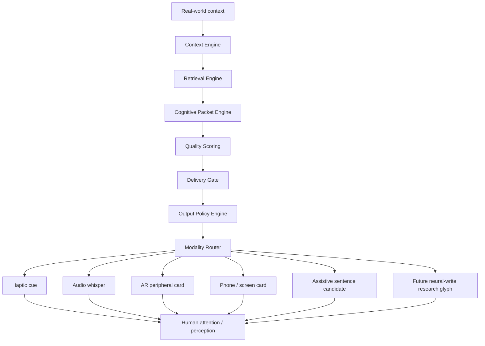
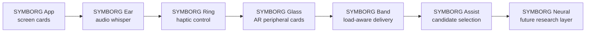
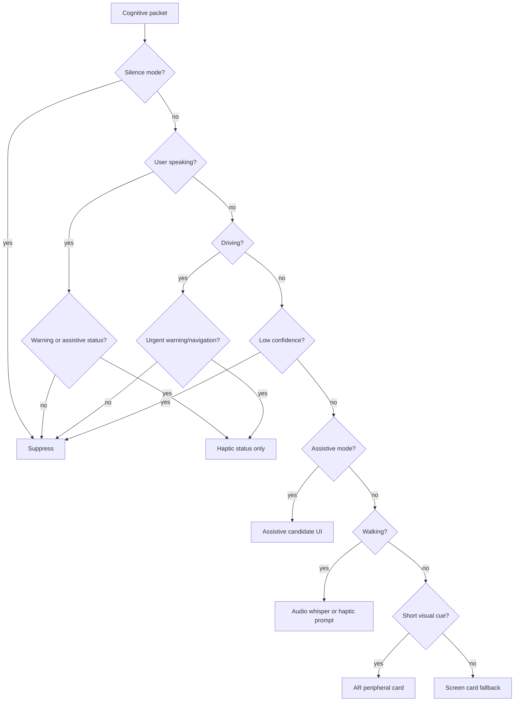

# Output Router Visuals

These diagrams describe how SYMBORG returns cognitive packets to the user after packet generation and evaluation.

## Symbiotic Return Stack

## Device Family Roadmap

## Output Routing Decision

## Design Note

The neural-write branch is intentionally framed as a future research track. It is not an early consumer feature and should not be presented as high-resolution internal display technology.

